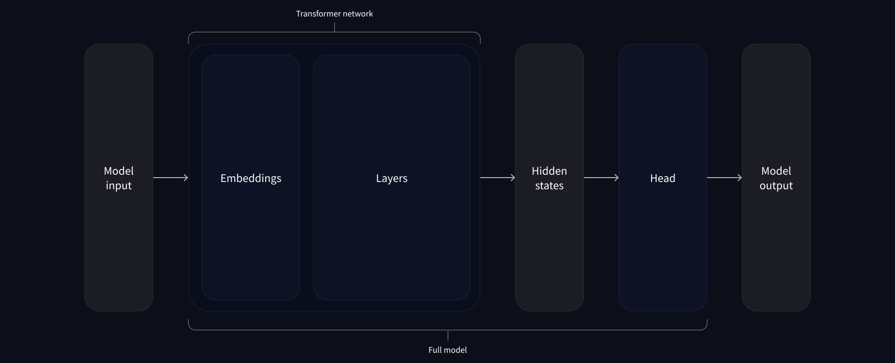

# behind pipeline
在第一章中，我们提到pipeline是一个接口将文字，输入，与输出相联系，那么在pipeline的背后，一个transformer架构是怎么运作的呢？
## 1.tokenizer (tokenlization)
与其他神经网络一样，Transformer 模型无法直接处理原始文本，因此我们管道的第一步是将文本输入转换为模型能够理解的数字。为此，我们使用 tokenizer（ tokenizer ），它将负责：

- 将输入拆分为单词、子单词或符号（如标点符号），称为 token（标记）
- 将每个标记（token）映射到一个数字，称为 input ID（inputs ID）
- 添加模型需要的其他输入，例如特殊标记（如 [CLS] 和 [SEP] ）
- - 位置编码：指示每个标记在句子中的位置。
- - 段落标记：区分不同段落的文本。
- - 特殊标记：例如 [CLS] 和 [SEP] 标记，用于标识句子的开头和结尾。
```python
from transformers import AutoTokenizer

checkpoint = "distilbert-base-uncased-finetuned-sst-2-english"
tokenizer = AutoTokenizer.from_pretrained(checkpoint)
```
当我们有了 tokenizer，我们就可以直接将我们的句子传递给它，我们就会得到一个 input ID（inputs ID） 的列表！剩下要做的唯一一件事就是将 input ID 列表转换为 tensor（张量）[多维向量]。

你在使用🤗 Transformers 时，您无需担心它背后的机器学习框架；它可能是 PyTorch 或 TensorFlow，或 Flax。但是，Transformers 模型只接受 tensor（张量） 作为输入。如果这是你第一次听说 tensor，你可以把它们想象成 NumPy 数组。NumPy 数组可以是标量（0D）、向量（1D）、矩阵（2D）或具有更多维度。这些都可以称为 tensor；其他 ML 框架的 tensor 使用方法也类似，通常与 NumPy 数组一样容易创建。

我们可以使用 return_tensors 参数指定我们想要得到的 tensor 的类型（PyTorch、TensorFlow 或纯 NumPy）
```python
raw_inputs = [
    "I've been waiting for a HuggingFace course my whole life.",
    "I hate this so much!",
]
inputs = tokenizer(raw_inputs, padding=True, truncation=True, return_tensors="pt")
print(inputs)
#现在不要担心 padding（填充）和 truncation（截断）；我们稍后会解释这些。这里要记住的是，你可以传递一个句子或一组句子，还可以指定要返回的 tensor 类型（如果没有传递类型，默认返回的是 python 中的 list 格式）。
```
```python
#此处是pytorch代码
{
    'input_ids': tensor([
        [  101,  1045,  1005,  2310,  2042,  3403,  2005,  1037, 17662, 12172, 2607,  2026,  2878,  2166,  1012,   102],
        [  101,  1045,  5223,  2023,  2061,  2172,   999,   102,     0,     0,     0,     0,     0,     0,     0,     0]
    ]), 
    'attention_mask': tensor([
        [1, 1, 1, 1, 1, 1, 1, 1, 1, 1, 1, 1, 1, 1, 1, 1],
        [1, 1, 1, 1, 1, 1, 1, 1, 0, 0, 0, 0, 0, 0, 0, 0]
    ])
}
```
## model

一旦我们得到了 `input_ids` 和 `attention_mask`，我们将其传递给预训练模型进行推理。模型通常会返回 **hidden states**（隐状态）或 **logits**，后者是未标准化的分数。
```python
outputs = model(**inputs)
```
在模型中，“**模型头（head）**”是指模型用于执行特定任务（如分类、问答等）的部分。Transformer 模型的基础部分（即 Transformer 层）处理输入数据，生成 hidden states。然后，**任务特定的模型头**会接收这些 hidden states，进行进一步的处理（例如，分类、预测等）。

对于情感分析（情感分类）任务，模型头 会将 hidden states 转换为一个 类别预测，例如将一个句子分类为“积极”或“消极”。

```python
from transformers import AutoModelForSequenceClassification
model = AutoModelForSequenceClassification.from_pretrained(checkpoint)
outputs = model(**inputs)
#AutoModelForSequenceClassification：这是 AutoModel 类的一个变体，它不仅包含 Transformer 模型，还包括用于序列分类的头部。这使得模型可以直接用于情感分析等任务。
```
输出 `logits` 会是一个形状为 `(batch_size, num_labels)` 的张量，其中 `batch_size` 是输入的句子数量（通常是 2 或更多），`num_labels` 是模型可以预测的类别数（在情感分析中通常是 2 类：积极和消极）。

## post-processing 后处理
从模型中获取的 `logits` 需要通过 Softmax 函数转换为概率分数。Softmax 将 logits 转化为 概率，每个类别的概率值在 0 到 1 之间，且所有类别的概率之和为 1。
```py
import torch
predictions = torch.nn.functional.softmax(outputs.logits, dim=-1)
```
输出：
```py
tensor([[0.0402, 0.9598],
        [0.9995, 0.0005]])
```
现在，预测结果变成了一个概率分布。例如，第一句是 0.0402 作为“消极”的概率，0.9598 作为“积极”的概率。

## 获取标签

最后，模型的配置 (model.config) 包含了类别标签的映射，通常是 id2label，它将每个类别的 ID 映射到实际的标签名称（如 "POSITIVE" 和 "NEGATIVE"）。
```py
model.config.id2label
```
输出：
```py
{0: 'NEGATIVE', 1: 'POSITIVE'}
```
结合 Softmax 的输出和 `id2label`，我们可以得出最终的预测结果。


Summarize:
1. Tokenizer 将文本转换为模型可以理解的格式（即 token ID）。

2. Transformer 模型 使用这些 token ID 来生成 hidden states，通过自注意力机制理解文本的上下文。

3. 模型头 对这些 hidden states 进行进一步的处理，输出 logits。

4. 通过 Softmax，将 logits 转换为 概率。

5. 最后，根据 id2label 映射，获取最终的分类标签（如积极或消极）。

# tokenizer

tokenizer 是 NLP 管道的核心组件之一。它们有一个非常明确的目的：将文本转换为模型可以处理的数据。模型只能处理数字，因此 tokenizer 需要将我们的文本输入转换为数字。在本节中，我们将确切地探讨 tokenization 管道中发生的事情。

但是，模型只能处理数字，因此我们需要找到一种将原始文本转换为数字的方法。这就是 tokenizer 所做的，并且有很多方法可以解决这个问题。目标是找到最有意义的表达方式 —— 即对模型来说最有意义的方式 —— 如果可能，还要找到最简洁的表达方式。

## 基于单词（Word-based）的 tokenization

想到的第一种 tokenizer 是基于词（word-based）的 tokenization。它通常很容易配置和使用，只需几条规则，并且通常会产生不错的结果。例如，在下图中，目标是将原始文本拆分为单词并为每个单词找到一个数字表示：

有多种方法可以拆分文本。例如，我们可以通过使用 Python 的 split() 函数，使用空格将文本分割为单词：
```py
tokenized_text = "Jim Henson was a puppeteer".split()
print(tokenized_text)
```

此外，还有一些基于单词的 tokenizer 的变体，对标点符号有额外的规则。使用这类 tokenizer，我们最终可以得到一些非常大的“词汇表（vocabulary）”，其中词汇表的大小由我们在语料库中拥有的独立 tokens 的总数确定。

每个单词都分配了一个 ID，从 0 开始一直到词汇表的大小。模型使用这些 ID 来识别每个词。

如果我们想用基于单词的 tokenizer 完全覆盖一种语言，我们需要为语言中的每个单词设置一个标识符，这将生成大量的 tokens。例如，英语中有超过 500,000 个单词，因此要构建从每个单词到 ID 的映射，我们需要跟踪这么多 ID。此外，像“dog”这样的词与“dogs”这样的词的表示方式不同，模型最初无法知道“dog”和“dogs”是相似的：它会将这两个词识别为不相关。这同样适用于其他相似的词，例如“run”和“running”，模型最初也不会看到它们的相似性。

最后，我们需要一个自定义 token 来表示不在我们词汇表中的单词。这被称为“unknown” token，通常表示为“[UNK]”或“<unk>”。如果你看到 tokenizer 产生了很多这样的 token 这通常是一个不好的迹象，因为它无法检索到一个词的合理表示，并且你会在转化过程中丢失信息。制作词汇表时的其中一个目标是 tokenizer 将尽可能少的单词标记为未知 tokens。

减少未知 tokens 数量的一种方法是使用更深一层的 tokenizer 即基于字符（character-based）的 tokenizer

## 基于字符（Character-based）的 tokenization

基于字符的 tokenizer 将文本拆分为字符，而不是单词。这有两个主要好处：

- 词汇量要小得多。
- unknown tokens （out-of-vocabulary）要少得多，因为每个单词都可以由字符构建。
但在此过程中也有一些问题，关于空格和标点符号：

这种方法也不是完美的。由于现在表示是基于字符而不是单词，因此人们可能会争辩说，从直觉上讲，它的意义不大：每个字符本身并没有多大意义，但是单词则不然。然而，这又因语言而异；例如，在中文中，每个字符比拉丁语言中的字符包含更多的信息。

另一件要考虑的因素是，这样做会导致我们的模型需要处理大量的 tokens：虽然一个单词在基于单词的 tokenizer 中只是一个 token，但当它被转换为字符时，很可能就变成了 10 个或更多的 tokens

为了两全其美，我们可以使用结合这两种方法的第三种技术：基于子词（subword）的 tokenization。

## 基于子词（subword）的 tokenization

基于子词（subword）的 tokenization 算法依赖于这样一个原则：常用词不应被分解为更小的子词，但罕见词应被分解为有意义的子词。

例如，“annoyingly”可能被视为一个罕见的词，可以分解为“annoying”和“ly”。这两者都可能作为独立的子词并且出现得更频繁，同时“annoyingly”的含义通过“annoying”和“ly”的复合含义得以保留。

## S & L

加载和保存 tokenizer 就像使用模型一样简单。实际上，它基于相同的两种方法： from_pretrained() 和 save_pretrained() 。这些方法会加载或保存分词器使用的算法（有点像模型的架构（architecture））以及其词汇表（有点像模型的权重（weights））。

加载使用与 BERT 相同的 checkpoint 训练的 BERT tokenizer 与加载模型的方式相同，只是换成了 Bert tokenizer 类：
```py
from transformers import BertTokenizer
tokenizer = BertTokenizer.from_pretrained("bert-base-cased")
#如同 AutoModel ， AutoTokenizer 类将根据 checkpoint 名称在库中获取正确的 tokenizer 类，并且可以直接与任何 checkpoint 一起使用：
from transformers import AutoTokenizer
tokenizer = AutoTokenizer.from_pretrained("bert-base-cased")
#现在我们可以像在上一节中显示的那样使用 tokenizer：
tokenizer("Using a Transformer network is simple")
Copied
{'input_ids': [101, 7993, 170, 11303, 1200, 2443, 1110, 3014, 102],
 'token_type_ids': [0, 0, 0, 0, 0, 0, 0, 0, 0],
 'attention_mask': [1, 1, 1, 1, 1, 1, 1, 1, 1]}
#保存 tokenizer 与保存模型完全相同：
tokenizer.save_pretrained("directory_on_my_computer")
```


于是你就得到了他——一个合格的transformer架构
```py
import torch
from transformers import AutoTokenizer, AutoModelForSequenceClassification

checkpoint = "distilbert-base-uncased-finetuned-sst-2-english"
tokenizer = AutoTokenizer.from_pretrained(checkpoint)
model = AutoModelForSequenceClassification.from_pretrained(checkpoint)
sequences = ["I've been waiting for a HuggingFace course my whole life.", "So have I!"]

tokens = tokenizer(sequences, padding=True, truncation=True, return_tensors="pt") #pytorch
output = model(**tokens)
```