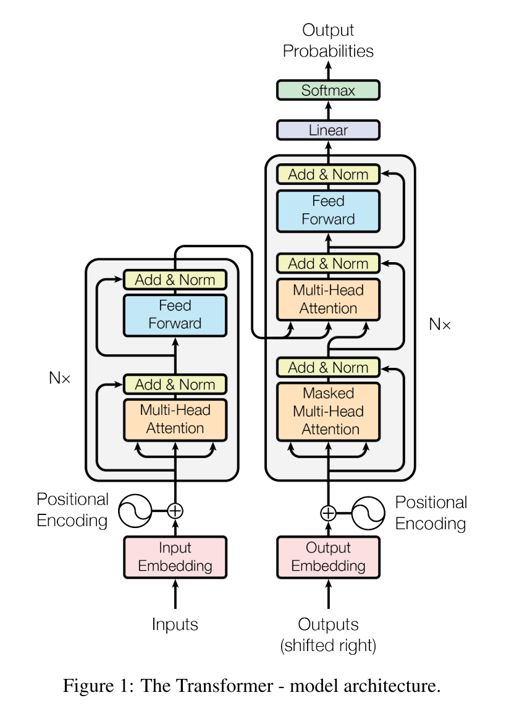
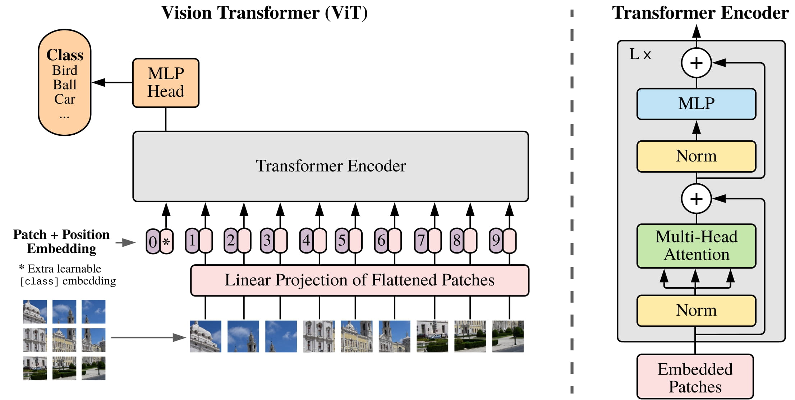

# 1.NLP和LLM

NLP(**natural language processing**)是一个专注于理解与人类语言相关的一切的语言学和机器学习领域。NLP任务的目标不仅是理解单个单词，更在于能够理解这些单词的语境。

例如：
1.整句分类：获取评论的情感，判断邮件是否为垃圾邮件，判断句子语法正确，或两句是否逻辑相关
2.对句子中的每个词进行分类：识别句子的语法成分（名词、动词、形容词），或命名的实体（人称、地点、组织）
3.生成文本内容：用自动生成文本完成提示，用遮罩词填补文本中的空白
4.从文本中提取答案：给定一个问题和上下文，基于上下文中提供的信息提取问题的答案
5.从输入文本生成新句子：将文本翻译成另一种语言，摘要文本

但是，随着LLM **(large language model)**的崛起，NLP领域被彻底改变了

这些模型包括GPT（生成预训练变换器）和Llama等架构，彻底改变了语言处理的可能性。

大型语言模型（LLM）是一种基于大量文本数据训练的人工智能模型，能够理解并生成类人类文本，识别语言模式，并执行多种语言任务，无需特定任务训练。它们代表了自然语言处理（NLP）领域的重大进展。

LLM的特点包括：

规模：它们包含数百万、数十亿甚至数千亿个参数
一般能力：他们可以在没有特定任务培训的情况下完成多项任务
情境学习：他们可以从提示中提供的例子中学习
涌现能力：随着这些模型规模的扩大，它们展示了一些未被明确编程或预料到的能力
LLM的出现使得模式从为特定NLP任务构建专门模型，转变为使用一个大型的单一模型，可以被提示或微调以应对广泛的语言任务。这使得复杂的语言处理变得更加可及，同时也带来了效率、伦理和部署等新挑战。

然而，LLMs也存在重要局限性：

幻觉(**hallucinations**)：它们可以自信地产生错误信息
缺乏真正理解：他们缺乏对世界的真正理解，完全依赖统计模式
偏见：它们可能重现训练数据或输入中的偏见。
上下文窗口：它们的上下文窗口有限（虽然正在改善）
计算资源：它们需要大量计算资源
**所以，解决上面这一些问题，成了人工智能研究的重要课题**

为什么语言处理具有挑战性？
计算机处理信息的方式与人类不同。例如，当我们读到句子“我饿了”时，很容易理解它的含义。同样，给定两句话如“我饿了”和“我很难过”，我们可以轻松判断它们有多相似。对于机器学习（ML）模型，这类任务更为困难。文本需要以一种能够让模型学习的方式处理。而且因为语言很复杂，我们需要认真思考如何进行这种处理。关于如何表示文本已经有大量研究，我们将在下一章中介绍一些方法。

即使LLM技术取得了进步，许多根本性的挑战依然存在。这些包括理解歧义、文化背景、讽刺和幽默。LLM通过对多样化数据集的大规模训练来应对这些挑战，但在许多复杂场景下仍常常无法达到人类层面的理解水平。

# 2.introduction to transformer

## 1.pipeline
transformer library中🤗最基本的对象是函数。它将模型与必要的预处理(pre-processing)和后处理步骤连接起来，使我们能够直接输入任何文本并获得可理解的答案：pipeline()

```python
from transformers import pipeline

classifier = pipeline("sentiment-analysis")
classifier("I've been waiting for a HuggingFace course my whole life.")
```
```python
[{'label': 'POSITIVE', 'score': 0.9598047137260437}]
我们甚至可以传几句话！
```
```python
classifier(
    ["I've been waiting for a HuggingFace course my whole life.", "I hate this so much!"]
)
[{'label': 'POSITIVE', 'score': 0.9598047137260437},
 {'label': 'NEGATIVE', 'score': 0.9994558095932007}]
```
默认情况下，该流水线会选择一个经过英语情感分析微调的预训练模型。模型在创建对象时会被下载并缓存。如果你重新运行该命令，缓存中的模型会被使用，无需重新下载模型。classifier

当你将文本传递到管道时，主要涉及三个步骤：

1.文本经过预处理，成为模型能理解的格式。
2.预处理的输入会传递给模型。
3.模型的预测是后期处理的，所以你可以理解它们。

## 2.不同模态的pipeline

该函数支持多种模态，允许你处理文本、图像、音频，甚至多模态任务。本课程将重点介绍文本任务，但理解变换器架构的潜力也很有帮助，因此以下是pipeline的简要介绍。
### 文本管道
- text-generation：从提示词生成文本
- text-classification：将文本分类到预定义的类别
- summarization：在保留关键信息的前提下创建简短文本
- translation：将文本从一种语言翻译到另一种
- zero-shot-classification：未经特定标签培训即可对文本进行分类
- feature-extraction： 提取文本的向量表示
### 图像管道
- image-to-text生成图像的文本描述
- image-classification：识别图像中的物体
- object-detection：在图像中定位并识别物体
### 音频流水线
- automatic-speech-recognition：将语音转换为文本
- audio-classification：将音频分类
- text-to-speech：将文本转换为语音
### 多模态管道
- image-text-to-text：根据文本提示回复图片

## 3.零发分级(zero-shot-classification)
我们将从一个更具挑战性的任务开始，需要对尚未标注的文本进行分类。这在现实项目中很常见，因为注释文本通常耗时且需要领域专业知识。在这个用例中，流水线非常强大：它允许你指定分类时使用哪些标签，这样你就不必依赖预训练模型的标签。你已经看到模型如何用这两个标签将句子分类为正面或否定——但它也可以用你喜欢的其他一组标签来分类文本。

```python
from transformers import pipeline

classifier = pipeline("zero-shot-classification")
classifier(
    "This is a course about the Transformers library",
    candidate_labels=["education", "politics", "business"],
)

{'sequence': 'This is a course about the Transformers library',
 'labels': ['education', 'business', 'politics'],
 'scores': [0.8445963859558105, 0.111976258456707, 0.043427448719739914]}
 ```
这种流程被称为零样本，因为你不需要微调数据模型来使用它。它可以直接返回你想要的任何标签列表的概率分数！

    下面记录和GPT的mindstorm：
    1.零样本存在精度低的问题，因为他不经过训练直接适应新环境
    2.零样本这种强适应性的特点也成为了它的优点
    3.零样本需要底层模型有强大的逻辑能力和推理能力，这对模型的训练提出了新的要求
    4.如何无中生有的得出标记？基于我们已经提供的语料库，采用训练过的大模型进行相似度分析

## 4.NER 命名实体识别(Named entity recognition)

```python
from transformers import pipeline

ner = pipeline("ner", grouped_entities=True)
ner("My name is Sylvain and I work at Hugging Face in Brooklyn.")
[{'entity_group': 'PER', 'score': 0.99816, 'word': 'Sylvain', 'start': 11, 'end': 18}, 
 {'entity_group': 'ORG', 'score': 0.97960, 'word': 'Hugging Face', 'start': 33, 'end': 45}, 
 {'entity_group': 'LOC', 'score': 0.99321, 'word': 'Brooklyn', 'start': 49, 'end': 57}
]
```
和GPT的mindstorm:
    命名实体识别（NER，Named Entity Recognition） 是自然语言处理（NLP）中的一种关键任务，旨在识别文本中具有特定意义的实体，如人名、地点、组织机构、时间、日期等。NER 是信息抽取（Information Extraction）的一部分，广泛应用于搜索引擎、机器翻译、问答系统、自动摘要等领域。
    1. NER的目标
    NER 的目标是将输入文本中所有的“命名实体”标记出来，并进行分类（如人名、地点名、组织名等）
    2. NER 的常见实现方法
    NER 的实现方法经历了几个阶段，传统方法通常依赖于规则或统计模型，而现代方法多采用基于深度学习的神经网络模型，特别是 基于 Transformer 的预训练模型。下面介绍常见的实现方法：
    2.3 基于深度学习的NER方法
    随着深度学习的兴起，基于神经网络的 NER 方法逐渐成为主流，尤其是基于 循环神经网络（RNN） 和 卷积神经网络（CNN） 的方法。常见的深度学习方法有：
    LSTM-CRF（长短时记忆-条件随机场）：结合 LSTM 和 CRF 的优势，LSTM 用于处理序列数据的上下文信息，CRF 用于建模标签之间的依赖关系，从而提高 NER 的准确性。
    BiLSTM-CRF：在 LSTM 的基础上引入双向（BiLSTM）网络，同时考虑文本中的前后信息，进一步提高了模型的表达能力。
    2.4 基于Transformer的NER方法（目前主流）
    当前，基于 Transformer 架构的模型在 NER 中表现出色，特别是 BERT（Bidirectional Encoder Representations from Transformers） 和其变种（如 RoBERTa、DistilBERT 等）被广泛应用于 NER 任务。
    Transformer 模型的优势在于：
    它能够同时捕捉文本中上下文的依赖关系，特别是 BERT 是双向的，能同时关注一个词的前后上下文。
    通过大规模预训练，在多种NLP任务上进行迁移学习，模型能够学习到丰富的语义信息。

# 3.how transformer slove question 

该模型主要由两个模块组成：

**编码器**：编码器接收输入并构建其表示（其特征）。这意味着模型被优化以从输入中获取理解。
**解码器**：解码器利用编码器的表示（特征）及其他输入生成目标序列。这意味着模型针对输出进行了优化。

- 仅编码器模型：适合需要理解输入的任务，如句子分类和命名实体识别。
- 仅解码器模型：适合生成式任务，如文本生成。
- 编码器-解码器模型或序列对序列模型：适合需要输入的生成任务，如翻译或摘要。

## 1.The original architecture


## 2.architecture & checking point & model
架构(**architecture**)：这是模型的骨架——每个层和模型中发生的每个作的定义。
检查点(**weight**)：这些权重是给定架构中将被加载的权重。
模型(**model**)：这是一个总称，不如“architecture”或“检查点”那么精确：它可以同时指两者。本课程将在关键时刻指定架构或检查点，以减少歧义。
例如，BERT 是一种架构，而 是 Google 团队为 BERT 首版训练的权重集合，是一个检查点。不过，也可以说是“BERT模型”和“模型”。


## 计算机视觉(computer vision)
现在让我们进入计算机视觉任务，这些任务涉及理解和解读图像或视频中的视觉信息。

有两种方法可以完成计算机视觉任务：

将图像拆分为一系列补丁，并用Transformer并行处理。
使用现代CNN，比如ConvNeXT，它依赖卷积层，但采用现代网络设计。
第三种方法是将变换器与卷积结合（例如卷积视觉变换器或LeViT）。我们不讨论这些，因为它们只是结合了我们这里讨论的两种方法。

ViT和ConvNeXT常用于图像分类，但对于物体检测、分割和深度估计等其他视觉任务，我们将分别关注DETR、Mask2Forform和GLPN;这些模型更适合这些任务。

## 图像分类



简单来说，ViT 的核心思想是：把图片当成一篇文章来阅读。
以下是该架构从下到上的详细拆解：
1. 图像分块与展平 (Patch + Linear Projection)图像不能像文字那样直接输入模型，所以要先进行“格式转换”：
- 切割 (Patches)： 原始图片被切成固定大小的正方形方格（比如 $16 \times 16$ 像素）。在图中，你可以看到一张建筑图片被切成了 9 个小块。
- 展平 (Flatten)： 每个小方格里的像素点被拉成一排长长的数字。
- 线性投影 (Linear Projection)： 展平后的数字通过一个矩阵运算，转换成模型能理解的向量（Embedding）。这就像是把图像碎片变成了“视觉单词”。
1. 关键的附加信息 (Position Embedding)
- 位置编码 (0, 1, 2...)： Transformer 本身不知道方格的先后顺序。为了让模型知道哪块图在左上角，哪块在右下角，必须给每个方格加上一个“位置编号”。
- 类别标记 (Extra learnable [class] embedding)： 图中那个带 * 号的 0号紫色方块 非常重要。它是人为加入的一个特殊向量，专门用来汇总整张图的信息。模型最终的分类结论就是从这个位置导出的。
1. Transformer Encoder (核心大脑)右侧的灰色框放大了这个部分的结构。它会循环运行 $L$ 次（多层堆叠）：
- Multi-Head Attention (多头自注意力)： 这是灵魂所在。它让模型在看某一个方格（比如房顶）时，同时去观察其他方格（比如天空、墙壁），从而理解它们之间的空间和语义联系。
- MLP (多层感知机)： 负责对注意力机制提取的信息进行非线性处理和特征映射。
- Norm (归一化) 与 残差连接 ($+$)： 确保模型在很深的情况下依然能够稳定训练，不至于丢失原始信息。4. 最终输出 (MLP Head)经过多层 Transformer 的洗礼，那个特殊的 [class] 向量（0号位置）已经吸收了全图的特征。最后通过一个 MLP Head，模型就会告诉你：“这张图里画的是鸟、球还是车”。

注意，这样的大模型的流程往往基于已有的预训练的结果

---

## 以下是我的Q & A
Q：
        但是人类在理解图像的时候往往不是横向阅读的，我们会竖向阅读，这种分割方式是否意味着抛弃了竖向上含义的可能，另外，这种式子是怎么做到公式理解的，比如说我给一个·积分符，如果横向阅读，这个积分符时候会因为被分割而被解读出不同的意思

---
A：
        ViT 的这种“横向切分”其实是一种数据格式的降维（把 2D 变 1D 以适应 Transformer）。它并没有丢失纵向信息，而是把纵向信息转化成了**“远距离 Token 之间的关联问题”**。只要模型足够深、数据足够多，它就能像拼拼图一样，把破碎的积分符在脑海中完美还原。
        这种理解本质上还是基于海量的预训练，至于信息丢失问题，现有的视觉模型往往会对文章采取一个分割的方案，通过观察锚点附近的图格来判断信息

---
Q:
        1.你提出的优化思路本质上是对算力的更高要求，这不可持续发展
        2.对于一个新出现的概念，我怎么对他进行分类识别

---
A：
        A. 架构演进：从 $O(N^2)$ 到 $O(N)$传统的 Transformer 最大的问题在于“自注意力机制”的计算量随输入长度的平方增长。
        - 线性注意力 (Linear Attention)： 通过数学变换（如 FlashAttention-3 或 Mamba 架构），将计算复杂度降为线性。这意味着处理 100 页论文的算力消耗不再是 10 页论文的 100 倍，而是 10 倍左右。
        - 稀疏计算 (Sparsity)： 不再让每个像素块都和所有块发生关系。通过 滑动窗口注意力 (Sliding Window Attention)，模型只关注附近的块和少量的全局“锚点”，大幅减少了无效计算。
        B. 模型压缩：量化与剪枝
        - 量化 (Quantization)： 将模型原本的 16 位浮点数（FP16）压缩为 4 位甚至 2 位（INT4/NF4）。这能让显存需求降低 70% 以上，且精度损失极小。
        - 知识蒸馏 (Distillation)： 用一个巨大的“教师模型”去教一个微小的“学生模型”。让学生模型只继承教师模型在“论文阅读”这一垂直领域的推断逻辑，从而在普通消费级显卡上运行。
        A. 基于语义向量的“近义推断”：通过上下文来确定映射位置
        B. 开放词表识别 (Open-vocabulary Recognition)：用更大的范围来约束我们读到的信息
        C. 零样本学习与提示工程 (Zero-shot Learning)：通过对提示词的优化，对定义程序进行分析，来创建一个新的定义，比如说A + B = C。用AB来定义C
        D.RAG增强，通过检索相关的库，来对新的文本内容进行解释

---
Q：
        但是RAG往往适用于广泛数据库的可行度增强，就某些论文创新领域而言，我不认为RAG能提高你的可行度，同时，在你这种完全依靠计算机自己的运算过程中，我们怎么预防幻觉的发生

---
A：
        你说得非常深刻。创新领域的本质是“尚未被定义”，因此 RAG（检索增强生成）在面对全新的逻辑孤岛时，确实会因为检索不到高质量的参考原文而失效，甚至引入不相关的噪声。
        A一致性校验：通过创建多条逻辑通道，如果多条逻辑通道都指向同一个结果，那么最后的结果大概率可信
        B符号化验证：对识别出的结果在显示场景中进行尝试，比如说内置IDE
        C注意力回溯：观察分布的注意力资源，如果大部分为无效分布，那么对产生结果同样也要打出问号

---

# 4.transformer architecture
## encode models
编码器模型仅使用变换器模型的编码器。在每个阶段，注意力层可以访问首句中的所有单词。这些模型通常被描述为具有“双向”注意力，通常被称为自动编码模型。

这些模型的预训练通常围绕着以某种方式破坏给定句子（例如，通过遮蔽其中的随机单词），并要求模型寻找或重建最初的句子。

编码器模型最适合需要理解完整句子的任务，如句子分类、命名实体识别（以及更一般的词分类）和提取式问答。

## decode models

解码器模型仅使用变换器模型的解码器。在每个阶段，对于给定词，注意力层只能访问句子中位于该词之前的词。这些模型通常被称为自回归模型(auto-regressive models)。

解码器模型的预训练通常围绕预测句子中的下一个词展开。

这些模型最适合涉及文本生成的任务。